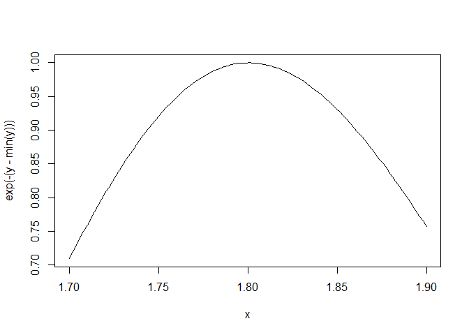
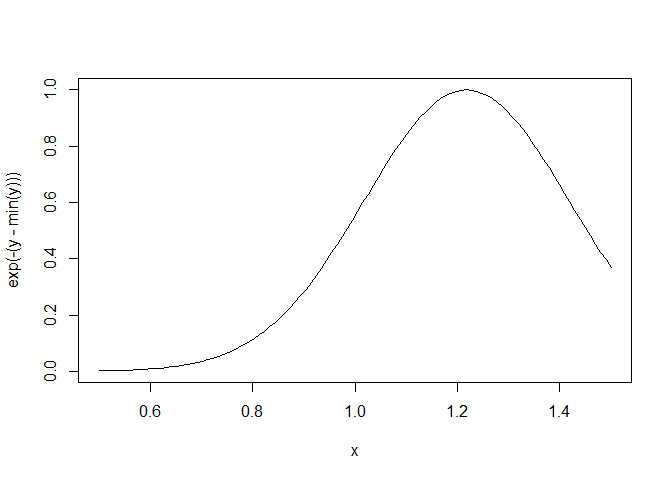

Scoping Rules - Optimization
================

## Application: Optimization

Why is any of this information useful?

-   Optimization routines in R like `optim`, `nlm`, and `optimize`
    require you to pass a function whose argument is a vector of
    parameters (e.g. a log-likelihood).
-   However, an object function might depend on a host of other things
    besides its parameters (like data).
-   When writing software which does optimization, it may be desirable
    to allow the user to hold certain parameters fixed.

## Maximizing a Normal Likelihood

Write a “constructor” function.

``` r
make.NegLogLik <- function(data, fixed = c(FALSE, FALSE)) {
  params <- fixed
  function(p) {
    params[!fixed] <- p
    mu <- params[1]
    sigma <- params[2]
    a <- -0.5*length(data)*log(2*pi*sigma^2)
    b <- -0.5*sum((data-mu)^2) / (sigma^2)
    -(a + b)
  }
}
```

Note: optimization functions in R *minimize* functions, so you need to
use the negative log-likelihood.

``` r
set.seed(1); normals <- rnorm(100, 1, 2)
nLL <- make.NegLogLik(normals)
nLL
```

    ## function(p) {
    ##     params[!fixed] <- p
    ##     mu <- params[1]
    ##     sigma <- params[2]
    ##     a <- -0.5*length(data)*log(2*pi*sigma^2)
    ##     b <- -0.5*sum((data-mu)^2) / (sigma^2)
    ##     -(a + b)
    ##   }
    ## <bytecode: 0x000000001577bc58>
    ## <environment: 0x00000000128f5088>

``` r
ls(environment(nLL))
```

    ## [1] "data"   "fixed"  "params"

## Estimating Parameters

``` r
optim(c(mu = 0, sigma = 1), nLL)$par
```

    ##       mu    sigma 
    ## 1.218239 1.787343

Fixing *σ* = 2

``` r
nLL <- make.NegLogLik(normals, c(FALSE, 2))
optimize(nLL, c(-1, 3))$minimum
```

    ## [1] 1.217775

Fixing *μ* = 1

``` r
nLL <- make.NegLogLik(normals, c(1, FALSE))
optimize(nLL, c(1e-6, 10))$minimum
```

    ## [1] 1.800596

## Plotting the Likelihood

``` r
nLL <- make.NegLogLik(normals, c(1, FALSE))
x <- seq(1.7, 1.9, len = 100)
y <- sapply(x, nLL)
plot(x, exp(-(y-min(y))), type = "l")
```

<!-- -->

``` r
nLL <- make.NegLogLik(normals, c(FALSE, 2))
x <- seq(0.5, 1.5, len = 100)
y <- sapply(x, nLL)
plot(x, exp(-(y-min(y))), type = "l")
```

<!-- -->

## Lexical Scoping Summary

-   Objective functions can be “built” which contains all the necessary
    data for evaluating thee function.
-   No need to carry around long argument lists - useful for interactive
    and exploratory work.
-   Code can be simplified and cleaned up
