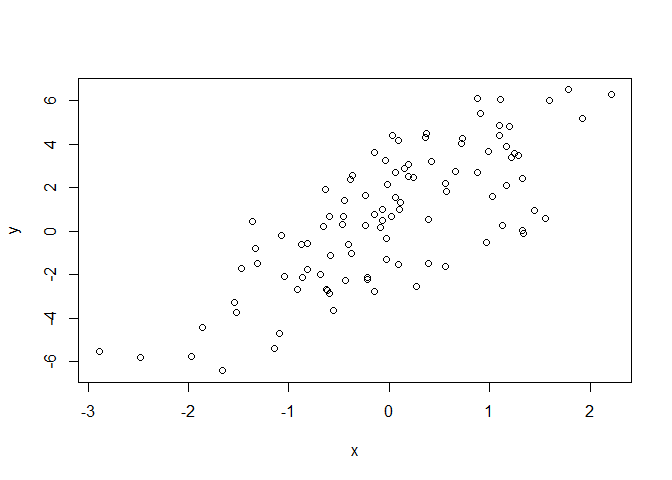
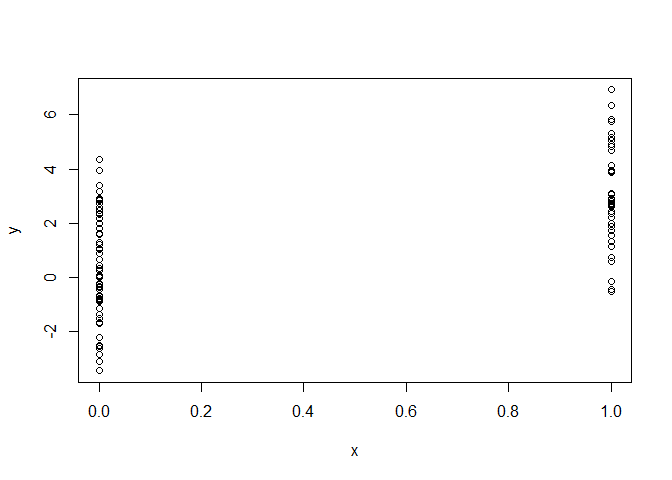
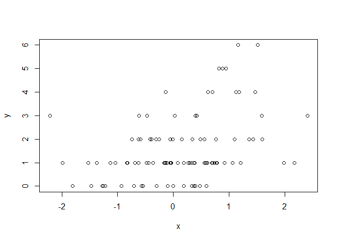

Simulation - Simulating a Linear Model
================

## Generating Random Numbers From a Linear Model

Consider simulating the following linear model:

*y* = *β*<sub>0</sub> + *β*<sub>1</sub>*x* + *ϵ*

where *ϵ* ∼ *N*(0, 2<sup>2</sup>). Also, assume
*x* ∼ *N*(0, 1<sup>2</sup>), *β*<sub>0</sub> = 0.5 and
*β*<sub>1</sub> = 2.

``` r
set.seed(20)
x <- rnorm(100) # standard normal
e <- rnorm(100, 0, 2) # epsilons distribution
b0 <- 0.5
b1 <- 2

y <- b0 + b1 * x + e
summary(y)
```

    ##    Min. 1st Qu.  Median    Mean 3rd Qu.    Max. 
    ## -6.4084 -1.5402  0.6789  0.6893  2.9303  6.5052

``` r
plot(x, y)
```

<!-- -->

What if `x` is binary? Assume both outcomes are equally likely.

``` r
set.seed(20)
x <- rbinom(100, 1, 0.5) # now use a binomial distribution
e <- rnorm(100, 0, 2) # epsilons distribution
b0 <- 0.5
b1 <- 2

y <- b0 + b1 * x + e
summary(y)
```

    ##    Min. 1st Qu.  Median    Mean 3rd Qu.    Max. 
    ## -3.4361 -0.2675  1.7804  1.5723  2.8810  6.9169

``` r
plot(x, y)
```

<!-- -->

## What About Generalized Linear Models (GLMs)?

Consider simulating a Poisson model where:

*Y* ∼ *P**o**i**s**s**o**n*(*μ*)

*l**o**g*(*μ*) = *β*<sub>0</sub> + *β*<sub>1</sub>

and *β*<sub>0</sub> = 0.5, *β*<sub>1</sub> = 0.3, and *x* is standard
Normal.

``` r
set.seed(1)
x <- rnorm(100)
b0 <- 0.5
b1 <- 0.3
log.mu <- b0 + b1 * x
y <- rpois(100, exp(log.mu))
summary(y)
```

    ##    Min. 1st Qu.  Median    Mean 3rd Qu.    Max. 
    ##    0.00    1.00    1.00    1.55    2.00    6.00

``` r
plot(x, y)
```

<!-- -->
